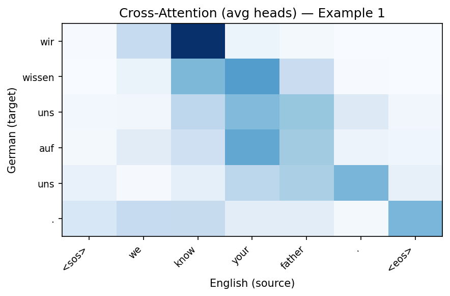
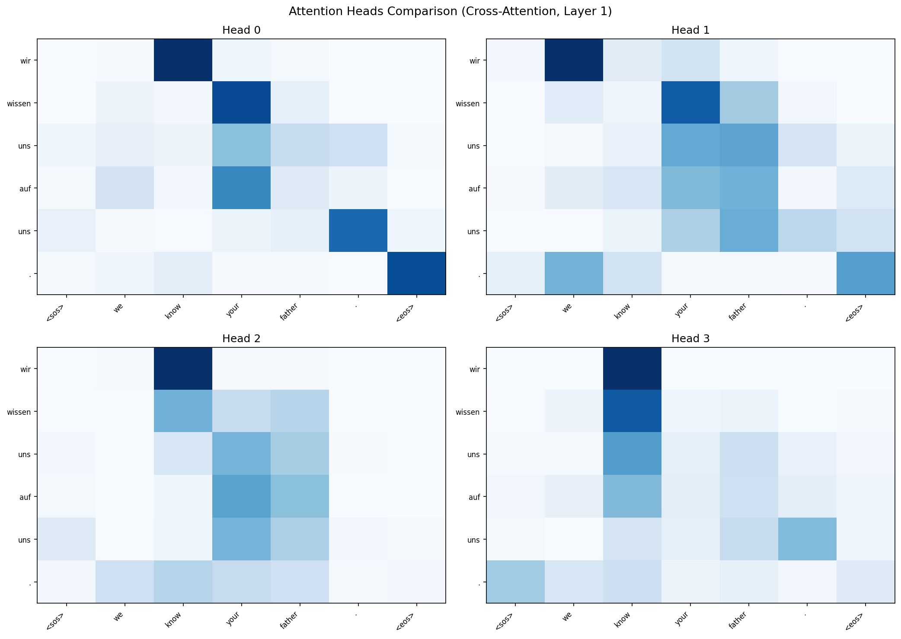

# Reconstructing the Transformer: Attention from Scratch on English–German Translation

## 1. Introduction

The Transformer architecture (Vaswani et al., 2017) replaced recurrence entirely with an attention mechanism that allows every position in a sequence to directly attend to every other position. This project reconstructs the core attention mechanism mathematically, implements the full encoder-decoder Transformer from scratch using only PyTorch primitives, and trains it on a real English–German translation dataset to analyze what the attention mechanism learns.

## 2. Background — The Attention Mechanism

**Scaled Dot-Product Attention.** Given Queries (Q), Keys (K), and Values (V), attention computes:

$$\text{Attention}(Q, K, V) = \text{softmax}\left(\frac{QK^T}{\sqrt{d_k}}\right) \cdot V$$

Each query "asks a question," each key "advertises what information it holds," and the dot product measures compatibility. The softmax produces a probability distribution, yielding a weighted combination of values. The $\sqrt{d_k}$ scaling prevents large dot products from pushing softmax into near-zero gradient regions.

**Multi-Head Attention.** Rather than a single attention computation, the input is projected $h$ times into subspaces of dimension $d_k = d_{\text{model}} / h$, attention runs independently per head, and results are concatenated and projected:

$$\text{MultiHead}(Q, K, V) = \text{Concat}(\text{head}_1, \ldots, \text{head}_h) \cdot W^O, \quad \text{head}_i = \text{Attention}(QW_i^Q, KW_i^K, VW_i^V)$$

Different heads can learn different relationship types — positional, syntactic, or semantic.

**Positional Encoding.** Since the Transformer has no recurrence, sinusoidal encodings inject position information:

$$PE_{(pos, 2i)} = \sin\left(\frac{pos}{10000^{2i/d_{\text{model}}}}\right), \quad PE_{(pos, 2i+1)} = \cos\left(\frac{pos}{10000^{2i/d_{\text{model}}}}\right)$$

## 3. Architecture

Our implementation follows the original encoder-decoder structure, scaled down. Each **encoder block** has two sub-layers: multi-head self-attention and a position-wise feed-forward network ($d_{\text{model}} \to d_{ff} \to d_{\text{model}}$ with ReLU), both wrapped with residual connections and layer normalization. Each **decoder block** adds a third sub-layer: multi-head cross-attention where decoder queries attend to encoder outputs.

**Configuration:** $d_{\text{model}} = 128$, $n_{\text{heads}} = 4$, $n_{\text{layers}} = 2$, $d_{ff} = 512$, dropout $= 0.1$, totaling **3,978,216 parameters** (vs. 65M in the original base model). No pre-built transformer modules were used — only `nn.Linear`, `nn.LayerNorm`, `nn.Embedding`, and standard tensor operations.

## 4. Dataset and Preprocessing

We use the Tatoeba English–German parallel corpus (331,266 raw pairs). After cleaning (lowercasing, Unicode normalization), length filtering (2–12 EN words, 2–15 DE words), deduplication, and quality filtering, we sampled 20,000 pairs split 80/10/10 (16K train, 2K val, 2K test).

Tokenization used a regex word-level splitter (`[a-zäöüß]+|[.,?!'-]`), producing vocabularies of **5,649 EN** and **9,064 DE** tokens (German's richer morphology yields more unique forms). Each token maps to a unique integer, with special tokens `<pad>=0`, `<sos>=1`, `<eos>=2`, `<unk>=3`.

## 5. Training

We trained for 10 epochs with Adam ($\text{lr} = 10^{-4}$), batch size 32, cross-entropy loss (ignoring padding). Teacher forcing feeds ground-truth target tokens shifted right. Training took ~6.5 minutes on CPU.

Training loss decreased from 6.03 to 3.35; validation loss from 5.02 to 3.62. The widening gap suggests the onset of overfitting, though both losses were still decreasing at epoch 10.

## 6. Results and Analysis

**Translation quality** is limited but instructive. The model learns correct sentence openings and pronoun alignment but struggles with content words:

| English | Reference | Generated |
|---|---|---|
| what ' s your opinion ? | was meinen sie ? | was ist dein ? |
| that ' s really very interesting . | das ist ja wirklich sehr interessant . | das ist sehr gut . |
| can you turn on the tv ? | kannst du den fernseher einschalten ? | kannst du den ganzen tag ? |

Corpus BLEU over 200 test pairs: **0.021** — low but expected for this model scale.

**Attention analysis** is the project's core contribution. Cross-attention weights from the decoder's last layer reveal how each German token attends to English source tokens:

For "we know your father," the generated "wir" attends strongly to "know" and the sentence start. The period aligns to the source period and `<eos>`. The model discovers source-target alignment without explicit supervision.

**Head specialization.** The four attention heads learn different patterns:

Head 0 shows diagonal positional alignment; Head 2 focuses on source-initial positions; Heads 1 and 3 capture broader patterns. This confirms multi-head attention provides genuine representational diversity.

## 7. Discussion

**Limitations.** The model is small (3.9M params), the dataset tiny (16K pairs), and word-level tokenization creates a large vocabulary without subword compositionality. Training for only 10 epochs leaves room for improvement.

**What would help.** Subword tokenization (BPE) would handle unseen words through composition. A larger model (4–6 layers, $d_{\text{model}} = 256$+) and more data from the full 331K corpus would improve lexical coverage. Learning rate warmup and label smoothing, as in the original paper, would stabilize training and improve generalization.

**Key takeaway.** Even a minimal Transformer trained for under 7 minutes learns meaningful attention patterns reflecting real linguistic structure — emergent word alignment and head specialization — confirming the mechanism's power as described in the original paper.

## 8. References

1. Vaswani, A., Shazeer, N., Parmar, N., Uszkoreit, J., Jones, L., Gomez, A. N., Kaiser, Ł., & Polosukhin, I. (2017). Attention Is All You Need. *Advances in Neural Information Processing Systems*, 30.

2. Tatoeba Project. https://tatoeba.org. Creative Commons Attribution 2.0 license.
