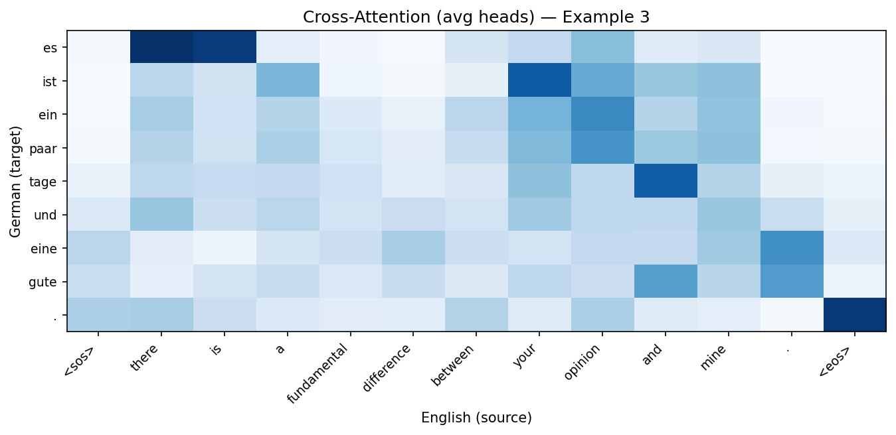

# Reconstructing the Transformer: Attention from Scratch on English–German Translation

## 1. Introduction

The Transformer architecture, introduced by Vaswani et al. in "Attention Is All You Need" (2017), fundamentally changed how sequence-to-sequence models are built. Prior to the Transformer, recurrent neural networks (RNNs) and their variants (LSTMs, GRUs) dominated machine translation, but they suffered from sequential computation bottlenecks and difficulty capturing long-range dependencies. The Transformer replaced recurrence entirely with an attention mechanism that allows every position in a sequence to directly attend to every other position, enabling massive parallelism and more effective modeling of long-range relationships.

The goal of this project is threefold: (1) reconstruct the Transformer's core attention mechanism mathematically, (2) implement the full encoder-decoder architecture from scratch using only PyTorch primitives, and (3) train it on a real English–German translation dataset to analyze what the attention mechanism actually learns. This is not an attempt to achieve state-of-the-art translation quality — rather, it is an exercise in understanding the mechanism by building it, training it, and visualizing its internal representations.

## 2. Background — The Attention Mechanism

### Scaled Dot-Product Attention

The fundamental operation in the Transformer is scaled dot-product attention. Given three matrices — Queries (Q), Keys (K), and Values (V) — attention computes a weighted sum of values where the weights are determined by the compatibility between queries and keys:

$$\text{Attention}(Q, K, V) = \text{softmax}\left(\frac{QK^T}{\sqrt{d_k}}\right) \cdot V$$

The intuition is straightforward: each query vector "asks a question," each key vector "advertises what information it holds," and the dot product between them measures compatibility. The softmax converts these raw compatibility scores into a probability distribution, and the result is a weighted combination of value vectors. The scaling factor $\sqrt{d_k}$ prevents the dot products from growing too large in magnitude as the dimension increases, which would push the softmax into regions with extremely small gradients.

### Multi-Head Attention

Rather than performing a single attention computation, the Transformer uses multi-head attention. The input is linearly projected $h$ times into different subspaces of dimension $d_k = d_{\text{model}} / h$, attention is computed independently in each subspace (each "head"), and the results are concatenated and projected back:

$$\text{MultiHead}(Q, K, V) = \text{Concat}(\text{head}_1, \ldots, \text{head}_h) \cdot W^O$$

where $\text{head}_i = \text{Attention}(QW_i^Q, KW_i^K, VW_i^V)$.

This allows different heads to learn different types of relationships. As we will see in our analysis, some heads learn positional alignment while others capture semantic or syntactic patterns.

### Positional Encoding

Since the Transformer has no recurrence and no convolution, it has no inherent notion of token order. Positional encodings are added to the input embeddings to inject sequence position information. The paper uses sinusoidal functions:

$$PE_{(pos, 2i)} = \sin\left(\frac{pos}{10000^{2i/d_{\text{model}}}}\right), \quad PE_{(pos, 2i+1)} = \cos\left(\frac{pos}{10000^{2i/d_{\text{model}}}}\right)$$

Each dimension of the positional encoding oscillates at a different frequency, creating a unique "fingerprint" for each position. The sinusoidal form was chosen because it allows the model to learn relative positions through linear transformations.

## 3. Architecture

Our implementation follows the original encoder-decoder structure from the paper, scaled down for a toy experiment.

**Encoder.** Each encoder block consists of two sub-layers: (1) multi-head self-attention, where every source token attends to every other source token, and (2) a position-wise feed-forward network (two linear transformations with ReLU activation: $d_{\text{model}} \to d_{ff} \to d_{\text{model}}$). Each sub-layer is wrapped with a residual connection and layer normalization: $\text{LayerNorm}(x + \text{Sublayer}(x))$.

**Decoder.** Each decoder block has three sub-layers: (1) masked multi-head self-attention over the target sequence (masking prevents attending to future positions during training), (2) multi-head cross-attention where decoder queries attend to encoder outputs (this is where the translation "alignment" happens), and (3) a position-wise feed-forward network. All three sub-layers use residual connections and layer normalization.

**Configuration.** Our model uses: $d_{\text{model}} = 128$, $n_{\text{heads}} = 4$, $n_{\text{layers}} = 2$, $d_{ff} = 512$, dropout $= 0.1$. This gives approximately **3,978,216 total parameters**. For comparison, the original Transformer base model used $d_{\text{model}} = 512$, 8 heads, 6 layers, and had 65M parameters. Our model is intentionally small — the goal is to observe attention behavior, not to maximize translation quality.

Crucially, no pre-built transformer modules (such as `nn.Transformer` or `nn.TransformerEncoder`) were used. Every component — scaled dot-product attention, multi-head attention, positional encoding, encoder blocks, decoder blocks, and the full model — was implemented from scratch using only `nn.Linear`, `nn.LayerNorm`, `nn.Embedding`, and standard tensor operations.

## 4. Dataset and Preprocessing

We use the Tatoeba English–German parallel corpus, a community-contributed dataset of sentence pairs. The raw dataset contains 331,266 pairs. We applied the following preprocessing pipeline:

1. **Text cleaning**: Unicode NFC normalization, lowercasing, removal of control characters and formatting artifacts
2. **Length filtering**: English sentences 2–12 words, German sentences 2–15 words, with a maximum length ratio of 2.5
3. **Quality filtering**: removed sentences with URLs, emails, excessive numeric content, or low "clean character" fractions
4. **Deduplication**: exact duplicate pairs removed
5. **Sampling**: shuffled with seed 42 and capped at 20,000 pairs

The resulting dataset was split 80/10/10 into 16,000 training, 2,000 validation, and 2,000 test pairs.

**Tokenization** used a simple regex-based word-level tokenizer matching the pattern `[a-zäöüß]+|[.,?!'-]`, which splits on word boundaries and preserves common punctuation. This produced vocabulary sizes of **5,649 tokens for English** and **9,064 tokens for German**. German's larger vocabulary reflects its richer morphology — compound words, case inflections, and grammatical gender create more unique word forms.

Each token is mapped to a unique integer index. Four special tokens are reserved: `<pad>` (index 0) for batch padding, `<sos>` (index 1) to signal the start of a sequence, `<eos>` (index 2) to signal the end, and `<unk>` (index 3) for out-of-vocabulary tokens.

## 5. Training

The model was trained for 10 epochs using the Adam optimizer with a constant learning rate of $10^{-4}$. The loss function was cross-entropy with `ignore_index=0` to exclude padding tokens from the loss computation. We used teacher forcing during training: the decoder receives the ground-truth target tokens (shifted right by one position) as input, and the loss is computed against the next token at each position.

Batch size was 32, giving 500 training batches per epoch. Training was performed on CPU and completed in approximately 6.5 minutes total (~40 seconds per epoch).

The training curve shows consistent improvement across all 10 epochs. Training loss decreased from 6.03 (epoch 1) to 3.35 (epoch 10), and validation loss decreased from 5.02 to 3.62. The gap between training and validation loss widened gradually in later epochs, indicating the onset of overfitting, though both losses were still decreasing. The best validation loss of **3.62** was achieved at epoch 10.

## 6. Results and Analysis

### Translation Quality

With only 3.9M parameters trained on 16K sentence pairs for 10 epochs, translation quality is limited. The model learns basic German sentence structure — it correctly starts many translations with appropriate pronouns ("wir," "ich," "tom," "es") and produces grammatically plausible fragments — but it struggles with content words and often generates repetitive or generic phrases.

Representative examples from the test set:

| English | Reference | Generated |
|---|---|---|
| we know your father . | wir kennen euren vater . | wir wissen uns auf uns . |
| what ' s your opinion ? | was meinen sie ? | was ist dein ? |
| that ' s really very interesting . | das ist ja wirklich sehr interessant . | das ist sehr gut . |
| can you turn on the tv ? | kannst du den fernseher einschalten ? | kannst du den ganzen tag ? |

The model captures the right sentence openings ("wir," "was ist," "das ist," "kannst du den") but fails to produce correct content words. The corpus BLEU score over 200 test pairs was **0.021**, which is very low but not unexpected for this scale of experiment.

### Attention Analysis

The most valuable output from this project is not the translation quality but the attention patterns the model learned. We extracted cross-attention weights from the decoder's last layer, which reveal how each generated German token attends to the English source tokens.

In Example 1 ("we know your father"), the attention pattern shows clear structure. The first generated token "wir" attends most strongly to "know" and the beginning of the source sentence. The model has learned that the German translation should begin by referencing the subject and verb of the English source. The period token at the end of the generated sequence attends primarily to the source period and `<eos>` token, showing that the model learned to align punctuation.

In Example 3 (a longer sentence about "fundamental difference"), we see that the first token "es" attends strongly to "<sos>" and "there" — correctly identifying the English "there is" construction that maps to German "es gibt/ist." Later tokens show more diffuse attention across multiple source positions, which is expected for a model that hasn't fully learned content word mappings.

### Attention Head Specialization

Perhaps the most interesting finding is that different attention heads learn different patterns. The 2×2 grid below shows all four cross-attention heads for the same example:

Head 0 shows a roughly diagonal pattern, focusing on positional alignment. Head 1 shows broader, more diffuse attention. Head 2 concentrates heavily on the beginning of the source sequence. Head 3 shows a pattern focused on the middle and end positions. This differentiation demonstrates that multi-head attention is not redundant — each head captures different aspects of the source-target relationship, exactly as theorized in the original paper.

### What the Model Learned vs. What It Struggles With

**Learned successfully:**
- German sentence structure (subject-verb ordering for simple sentences)
- Pronoun alignment (English "we" → German "wir," "I" → "ich")
- Punctuation alignment (periods, question marks)
- Basic function words ("ist," "hat," "du," "nicht")
- Positional correspondence through attention

**Struggles with:**
- Content/open-class vocabulary (nouns, adjectives, specific verbs)
- German compound words and morphological variants
- Longer sentences (attention becomes diffuse)
- Avoiding repetitive generic phrases ("ein paar tage," "ist sehr gut")

## 7. Discussion

### Limitations

This experiment has several deliberate limitations. The model is extremely small (3.9M parameters vs. 65M+ for production systems). The dataset is tiny (16K training pairs vs. millions used in real NMT). Word-level tokenization with a simple regex creates an artificially large vocabulary without the subword compositionality that BPE or SentencePiece provide. And training for only 10 epochs on CPU leaves substantial room for improvement.

### What Would Improve Results

Several changes would dramatically improve translation quality:

1. **Subword tokenization** (BPE or SentencePiece) would reduce vocabulary size from ~9,000 to ~8,000 shared tokens, handle unseen words through subword composition (e.g., splitting "abzunehmen" into "ab" + "zu" + "nehmen"), and significantly improve generalization to rare word forms.

2. **A larger model** ($d_{\text{model}} = 256$ or 512, 4–6 layers) would increase capacity for learning the complex lexical and syntactic mappings required for translation. Our 2-layer model likely lacks the depth to build hierarchical representations.

3. **More training data** from the full 331K-pair Tatoeba corpus (rather than the 16K subsample) would expose the model to far more vocabulary and syntactic patterns. Data quantity is often the single most impactful factor in neural MT performance.

4. **Learning rate warmup** as described in the original paper (linear warmup for 4,000 steps followed by inverse square root decay) would stabilize early training and allow a higher peak learning rate.

5. **Label smoothing** ($\epsilon = 0.1$) would reduce the model's overconfidence in its predictions and improve generalization, as demonstrated in the original paper.

6. **Longer training** with gradient accumulation and a larger effective batch size would allow the model to converge to a better optimum. Our 10-epoch training likely stopped well before convergence.

### Key Takeaway

Even a minimal Transformer with under 4 million parameters, trained on 16,000 sentence pairs for under 7 minutes, learns meaningful attention patterns that reflect real linguistic structure. The cross-attention heatmaps show that the model discovers source-target alignment without any explicit alignment supervision — this emergent alignment is one of the most powerful properties of the attention mechanism. The head specialization we observed confirms that multi-head attention provides genuine representational diversity, not mere redundancy.

## 8. References

1. Vaswani, A., Shazeer, N., Parmar, N., Uszkoreit, J., Jones, L., Gomez, A. N., Kaiser, Ł., & Polosukhin, I. (2017). Attention Is All You Need. *Advances in Neural Information Processing Systems*, 30.

2. Tatoeba Project. (n.d.). https://tatoeba.org. Creative Commons Attribution 2.0 license.
